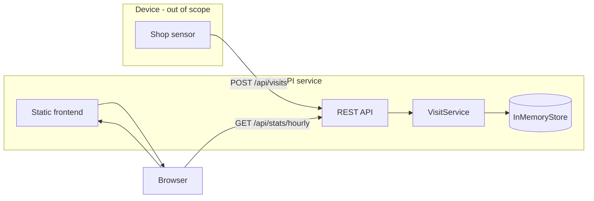

# Technical Decisions

## Stack

**FastAPI + in-memory storage** was chosen to keep the solution small and reviewable. The assignment allows in-memory persistence, so a database adds setup cost without clear benefit for this scope. FastAPI provides structured request/response validation (Pydantic) and auto-generated OpenAPI docs at `/docs`.

## Architecture

Layers:

- **Routers** — HTTP boundary only
- **VisitService** — business rules (tree planting, validation)
- **InMemoryStore** — thread-safe data access

## Data model

- **Customers** keyed by `customer_id`, tracking `total_visits`, `trees_planted`, and `last_connection_at`.
- **Hourly buckets** keyed by `YYYY-MM-DDTHH` in UTC for global visit aggregation on the dashboard.

Tree planting uses modulo on total visits: every Xth visit increments `trees_planted`. This is simple and matches the requirement without tracking partial progress separately.

## Concurrency

A `threading.Lock` wraps all store mutations so concurrent device posts within one process remain consistent. For multi-process deployment, an external store would be required.

## Hourly aggregation

The dashboard shows **global** visits per hour (all customers combined). Per-customer detail is available via `GET /api/customers/{id}`. Buckets cover a sliding window (default 24 hours) with zero-filled gaps so the chart is continuous.

## Frontend

Vanilla HTML/JS with Chart.js avoids a build toolchain. The page polls `/api/stats/hourly` every 30 seconds.

## Possible improvements

- Persistent storage (PostgreSQL, Redis)
- Device authentication (API keys or mTLS)
- Idempotency keys to handle duplicate device events
- Per-shop aggregation if multiple locations exist
- WebSocket push instead of polling for the dashboard
- Admin endpoint to change `VISITS_PER_TREE` at runtime
